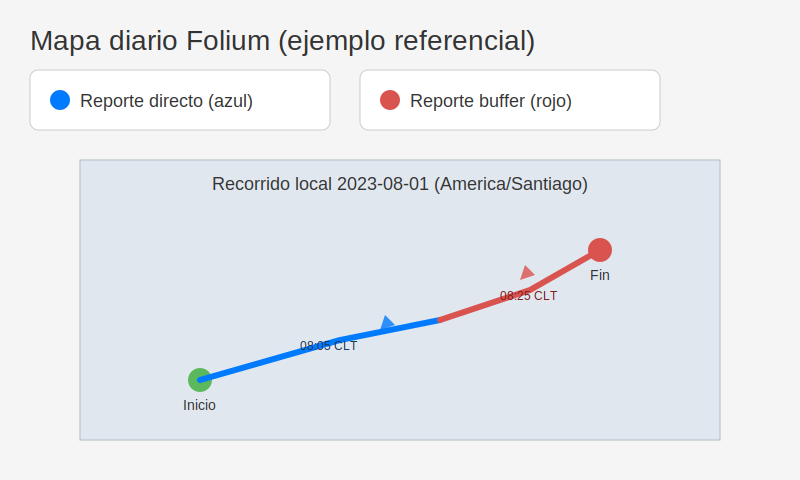

# Mapas diarios Folium para recorridos Queclink

Esta guía explica cómo generar mapas diarios con los recorridos procesados desde las tramas
`+RESP:GTERI`. El pipeline usa Folium, trabaja con horas locales de Chile y diferencia los
reportes **directos** (no buffer) en azul y **buffer** en rojo.



## Preparación

1. Genera una base SQLite con `queclink_tramas.py` a partir de tus archivos.
2. Instala las dependencias del módulo de visualización:

   ```bash
   pip install folium pytz python-dateutil
   ```

3. Identifica el IMEI a visualizar (columna `imei` de la tabla `gteri_records`).

## Generar un mapa diario

Usa el CLI `viz` (incluido en este repositorio) indicando la fecha **local** que deseas
analizar. El comando produce un HTML interactivo y un GeoJSON con los puntos.

```bash
python -m viz.cli \
  --db salida.db \
  --imei 864696060004173 \
  --date 2023-08-01 \
  --provider "CartoDB Positron" \
  --out salidas/mapa_diario
```

> 💡 **¿Trabajas en Windows?**
>
> - En **PowerShell**, cambia `python` por `py` y escribe todo en una línea (o usa acentos
>   graves `` ` `` para dividirlo).
>
>   ```powershell
>   py -m viz.cli --db salida.db --imei 864696060004173 --date 2023-08-01 `
>     --provider "CartoDB Positron" --out salidas/mapa_diario
>   ```
>
> - En **CMD**, reemplaza las barras invertidas por carets (`^`) y ajusta la ruta de salida
>   usando `\`.
>
>   ```cmd
>   py -m viz.cli ^
>     --db salida.db ^
>     --imei 864696060004173 ^
>     --date 2023-08-01 ^
>     --provider "CartoDB Positron" ^
>     --out salidas\mapa_diario
>   ```

Salida esperada:

```
Mapa generado: salidas/mapa_diario.html
GeoJSON generado: salidas/mapa_diario.geojson
```

### Convenciones del mapa

- **Azul**: reportes directos (`+RESP:GTERI`).
- **Rojo**: reportes buffer (`+BUFF:GTERI`).
- Los tooltips muestran hora local (`America/Santiago`), coordenadas y tipo de reporte.
- El mapa incluye marcadores de inicio/fin, flechas con dirección y capas activables.

## Automatización en CI

El workflow `viz.yml` (GitHub Actions) ejecuta pruebas del módulo, genera un mapa de ejemplo y
publica los artefactos HTML/GeoJSON para revisión rápida. Puedes reutilizarlo como plantilla para
otros proyectos o entornos.
